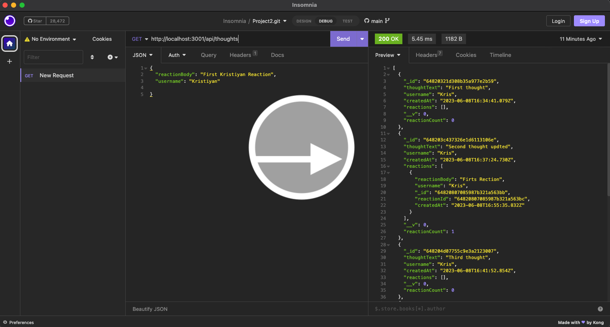

[](https://choosealicense.com/licenses/mit)     
# Social-Network
## Table of Contents
* [License](#license)
* [Description](#description)
* [Installation](#installation)
* [Usage](#usage)
* [How to Contribute](#how-to-contribute)
* [Questions](#questions)
## License
 * This application is covered under: [MIT License](https://choosealicense.com/licenses/mit)
## Description
An Social-Network back end server side is a platform that handles the processing of information and functionality for an online social api. It is responsible for managing the database, processing friends, thoughts, reactions and more. The server supports HTTP methods such as POST, PUT, DELETE, and GET to allow for creating, updating, deleting, and retrieving data. These methods enable the server to interact with the client-side application and database, providing a seamless experience for customers using the online api. 
## Installation

* You will need to run this command to install the application and dependencies.
```
npm install
```
* You will need to run this command to start the program.
```
npm start
```

## Usage
In order to use the server you will need to clone the repository from GitHub provided in the link below, run the commands in the installation section.
## How to Contribute
For and suggestions or contributions you can reach me at my email address or you can clone to code and edit it the way it will suite you the best.

## Questions
* Reach me here on my GitHub account.

    [krisefov](https://github.com/kristefov) 

* Reach me on my email address for additional questions.

    kristiyan.tefov@icloud.com

## Link
Link to repository:

https://github.com/kristefov/Social-Network

Link to Video Tutorial:
* click on the image to open the video tutorial

[](https://drive.google.com/file/d/1x_hqunoQLhPhvzQJPBdQ3TISC1uwQShg/view?usp=sharing)


